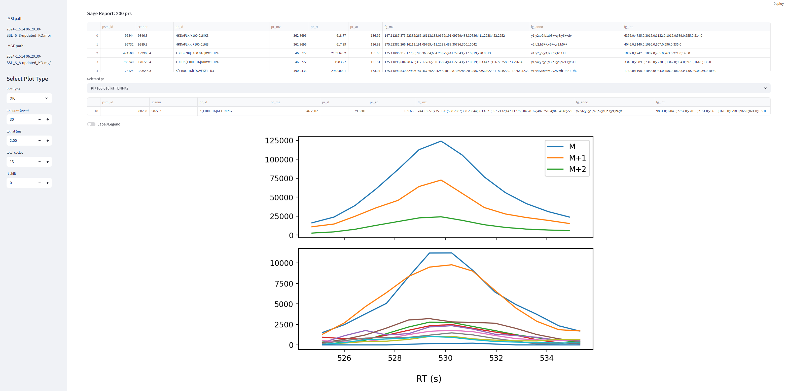
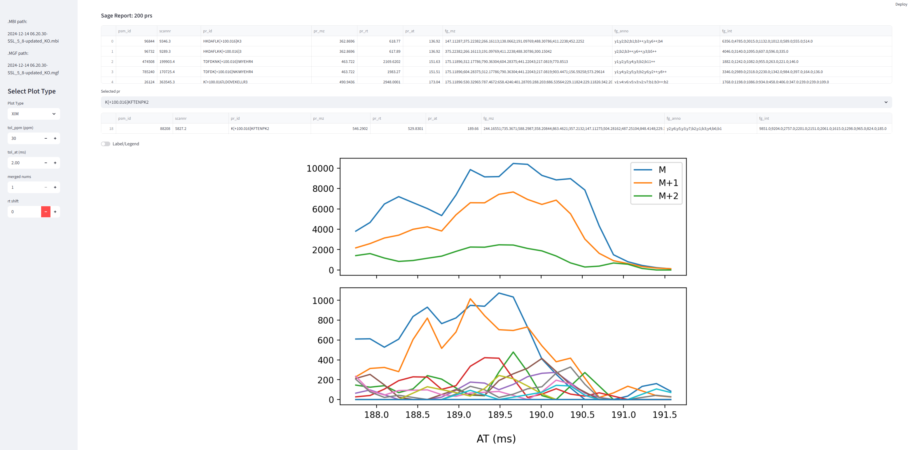
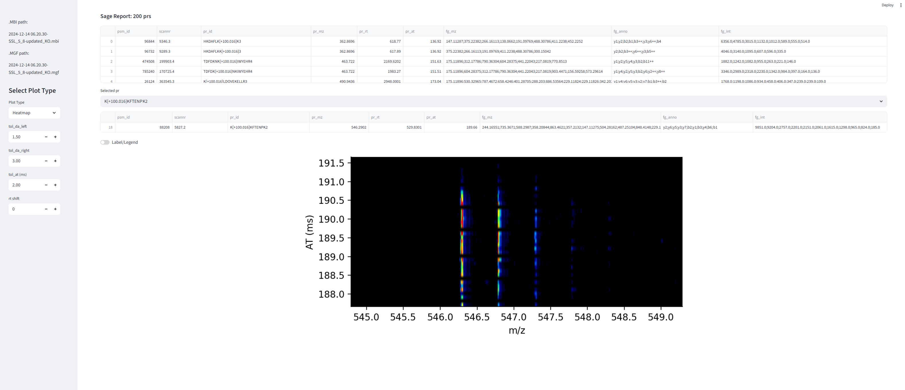
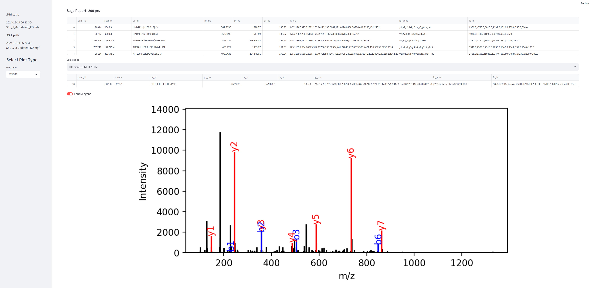

# xTracer

Parallel Accumulation with Mobility Aligned Fragmentation ([PAMAF](https://doi.org/10.1016/j.mcpro.2026.101608)) fragments mobility-separated precursors without quadrupole isolation. Existing peptide identification tools are not optimized for PAMAF data. xTracer uses chromatographic and mobility correlations to associate precursor and fragment ions, reconstruct pseudo-spectra, convert PAMAF data into single-window diaPASEF in `.d` format, and inspect Sage identifications interactively.

## Contents

- [Datasets](#datasets)
- [Installation](#installation)
- [Commands](#commands)
- [Search: generate pseudo-spectra](#xtracer-search)
- [Convert: create TDF `.d` datasets](#xtracer-convert)
- [GUI: inspect Sage identifications](#xtracer-gui)
- [Logs](#logs)
- [Troubleshooting](#troubleshooting)

## Datasets

The PAMAF varying-sample-load and varying-throughput datasets are available from [MassIVE MSV000099577](https://massive.ucsd.edu/ProteoSAFe/dataset.jsp?accession=MSV000099577).

## Installation

xTracer currently requires Windows and Python 3.12.11.

```powershell
conda create -n xtracer_env python=3.12.11
conda activate xtracer_env
pip install xtracer-pamaf
```

The latest GitHub version can instead be installed with:

```powershell
pip install git+https://github.com/xomicsdatascience/xtracer.git
```

### MBI SDK

Reading `.mbi` files requires the MOBILion MBI SDK, which is publicly available for non-commercial use from the [official MOBILion MBI SDK repository](https://github.com/MOBILionSystems/MOBILion_MBI_SDK), subject to the [MOBILion Software Use Agreement](https://github.com/MOBILionSystems/MOBILion_MBI_SDK/blob/main/LICENSE.md). On Windows, copy these three files from the SDK repository into the installed `xtracer/sdk` directory:

```text
lib/win-x64/swig-python/_mbisdk.pyd
lib/win-x64/MBI_SDK.dll
lib/win-x64/swig-python/mbisdk.py
```

The destination can be located with:

```powershell
python -c "from pathlib import Path; import xtracer.sdk; print(Path(xtracer.sdk.__file__).parent)"
```

The Mobilion SDK is not distributed with xTracer.

## Commands

```text
xtracer search   Generate DDA-like pseudo-spectra from PAMAF .mbi files.
xtracer convert  Convert PAMAF .mbi files into single-window diaPASEF .d directories.
xtracer gui      Open the interactive viewer for Sage identifications.
```

Use `xtracer --help` for the command overview or `xtracer <command> --help` for command-specific arguments.

## `xtracer search`

`xtracer search` processes every `.mbi` file directly inside the input folder and writes one `.mgf` file per input.

Recommended combined XIC/XIM search:

```powershell
xtracer search -ws_in "D:\PAMAF\amount" -xix
```

Choose exactly one correlation mode:

```powershell
xtracer search -ws_in "D:\PAMAF\amount" -xic
xtracer search -ws_in "D:\PAMAF\amount" -xim
xtracer search -ws_in "D:\PAMAF\amount" -xix
```

By default, results are written to `<input-folder>\mgf_xtracer`. A different output-folder name can be selected with `-out_name`:

```powershell
xtracer search -ws_in "D:\PAMAF\amount" -out_name xtracer200 -xix
```

### Search parameters

| Parameter | Default | Description |
|---|---:|---|
| `-ws_in` | required | Folder containing the input `.mbi` files. |
| `-out_name` | `mgf_xtracer` | Output-folder name created below `-ws_in`. |
| `-xic` | — | Use chromatographic correlations. |
| `-xim` | — | Use mobility correlations. |
| `-xix` | — | Use the mean of XIC and XIM correlations. |
| `-write_pcc` | off | Write PCC as a third value for each retained fragment peak. |
| `-pr_mz_min` | `200` | Minimum precursor m/z. |
| `-charge_min` | `2` | Minimum precursor charge. |
| `-charge_max` | `4` | Maximum precursor charge. |
| `-at_min` | `100` | Minimum arrival time in milliseconds. |
| `-tol_at_area` | `2.0` | Arrival-time integration tolerance in milliseconds. |
| `-tol_at_shift` | `1.0` | Arrival-time matching tolerance in milliseconds. |
| `-tol_ppm` | `30` | m/z matching tolerance in ppm. |
| `-tol_iso_num` | `2` | Required isotope peaks to the right of M; `2` requires M, M+1, and M+2. |
| `-tol_pcc` | `0.3` | Minimum precursor–fragment PCC. |
| `-tol_neighbor1_num` | `5` | MS1 local-neighbor threshold. |
| `-tol_neighbor2_num` | `3` | MS2 local-neighbor threshold. |
| `-tol_fg_num` | `10` | Minimum number of matched fragment ions. |
| `-xim_across_cycle_num` | `3` | Positive odd MS1/MS2 cycle span used for XIM processing. |
| `-xic_across_cycle_num` | `7` | Positive odd MS1/MS2 cycle span used for XIC extraction. |

The standard `.mgf` output can be searched with a DDA search engine such as Sage. `-write_pcc` is intended for diagnostic inspection because it adds a third column to each fragment line.

## `xtracer convert`

### Convert one file

Write beside the input file using the same base name:

```powershell
xtracer convert "D:\PAMAF\sample.mbi"
```

Specify the output `.d` directory:

```powershell
xtracer convert "D:\PAMAF\sample.mbi" -o "D:\results\sample.d"
```

### Convert a folder

Convert every `.mbi` file directly inside `-ws_in`:

```powershell
xtracer convert -ws_in "D:\PAMAF\amount"
```

The default batch output folder is `<input-folder>\mbi2d`. Select another folder name with:

```powershell
xtracer convert -ws_in "D:\PAMAF\amount" -out_name convert_to_d
```

Each input becomes `<output-folder>\<sample-name>.d`. Every `.d` directory contains:

```text
analysis.tdf
analysis.tdf_bin
```

Existing outputs are skipped by default. Use `--force` to delete and recreate each existing target:

```powershell
xtracer convert -ws_in "D:\PAMAF\amount" -out_name convert_to_d --force
```

The converter represents PAMAF data as single-window diaPASEF in `.d` format and maps PAMAF arrival time linearly to the TDF ion-mobility coordinate. A progress bar reports completed frames and estimated remaining time. One conversion invocation produces one log file, including batch conversion of multiple inputs.

## `xtracer gui`

The GUI displays XIC, XIM, MS1 isotope heatmaps, and annotated MS/MS spectra for xTracer results searched with Sage.

Run Sage with `--annotate-matches` so that it produces both:

```text
results.sage.tsv
matched_fragments.sage.tsv
```

Then launch the viewer:

```powershell
xtracer gui `
  --mbi "D:\PAMAF\sample.mbi" `
  --mgf "D:\PAMAF\mgf_xtracer\sample.mgf" `
  --sage-results "D:\PAMAF\sage_out\results.sage.tsv" `
  --out-dir "D:\PAMAF\gui_logs"
```

If `--matched-fragments` is omitted, xTracer looks for `matched_fragments.sage.tsv` beside `results.sage.tsv`. Otherwise, specify it explicitly:

```powershell
xtracer gui --mbi sample.mbi --mgf sample.mgf `
  --sage-results results.sage.tsv `
  --matched-fragments matched_fragments.sage.tsv `
  --out-dir gui_logs
```

The default web browser opens automatically. Keep the terminal running while using the GUI and press `Ctrl+C` to stop it.

- XIC

  

- XIM

  

- MS1 isotope heatmap

  

- MS/MS spectrum

  

## Logs

Every command creates a timestamped `.log` file in its output location. The log records:

- xTracer and Python versions;
- the executed command;
- all effective parameters, including defaults;
- input counts and output paths;
- processing status and errors;
- conversion timing statistics where applicable.

## Troubleshooting

- Confirm that Python is version 3.12.11 and that all three MBI SDK files are in the installed `xtracer/sdk` directory.
- Run `xtracer <command> --help` to verify the installed command and parameters.
- Report problems through [GitHub Issues](https://github.com/xomicsdatascience/xtracer/issues) or email [jian.song.2025@outlook.com](mailto:jian.song.2025@outlook.com).

## License

xTracer is released under the MIT License. The MOBILion MBI SDK is available separately under the MOBILion Software Use Agreement and is not distributed with xTracer.
